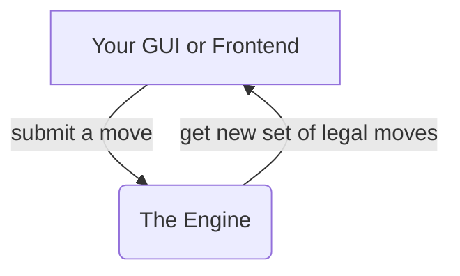

# Chess Engine README

## State of the project: 
### Completed
* A [basic GUI](https://chess-game-gules.vercel.app/) in which complete games can be played. 
* Functional engine that correctly lists all possible legal moves for any board state
* Also correctly handles all check states, and obscure accumulating states like [en pessant](https://en.wikipedia.org/wiki/En_passant), [threefold repetition](https://en.wikipedia.org/wiki/Threefold_repetition), and the [50-move draw rule](https://en.wikipedia.org/wiki/Fifty-move_rule)

### Next steps
* Move the code to a more common / standard package type like ES modules or an npm package. 
* Improve the UI
* Implement JSON message interface to completely separate the engine from any given UI

## Structure of the Engine

#### It's the equivalent of one JavaScript File
The engine is housed in several JavaScript files that are meant to be called in a specific order: 
```
utilities_and_reference.js
mutables_initializers.js
blocking_functions.js
king_threat_functions.js
movement_options_functions.js
engine_index.js
```
 In HTML, assuming a directory named "chess_engine_mbc", this would look something like ...  
```
<script src="chess_engine_mbc/utilities_and_reference.js"></script>
<script src="chess_engine_mbc/mutables_initializers.js"></script>
<script src="chess_engine_mbc/blocking_functions.js"></script>
<script src="chess_engine_mbc/king_threat_functions.js"></script>
<script src="chess_engine_mbc/movement_options_functions.js"></script>
<script src="chess_engine_mbc/engine_index.js"></script>
```
However, as the above loading scheme suggests, the functionality is no different than it would be if all of these JavaScript files were copied into a single file. They already share a namespace. 

#### A note on the orginization
The engine was originally written with CommonJS after extensive research into that scheme, however I realized browsers would not support this so organized the code as a series of sequentially loading files. It is at least organized through the [module-by-closure pattern](https://github.com/reppohopper/js_patterns/blob/main/modules_by_closure.md), which is the way that ES modules work under the hood.  


# Possible Implementation: JSON Message Interface 
## Explanation
#### Reasoning: why a JSON based message interface in the first place?
Communicating with the engine through JSON might feel a bit weighty, but has the following advantages:
* Allows the engine to operate independently from any GUI or client connecting to it. This forces a possibly helpful structural divide, but it also has practical benefits like allowing the engine to be easily placed in a server. 

* Allows the GUI and engine, to be written in different languages, or exist in different places (like on a client, and server, respectively).

*  It will hopefully be secure in that it can simply send a "failure: illegal move, please retry" response to any request it gets that is anything besides a legal piece move (or some other highly structured expected input type). It can just listen in one place for these incoming messages rather than exposing its code. 

### The most common message type: The new set of legal moves.
The basic loop. You make moves, it gives you your next possible moves. 



## Request Messages to the Engine 

### Move piece request message structure
Move a piece by sending a JSON string conforming to the following pattern:
```
{
    "message_type": "peice move", 
    "from": "D2",
    "to": "D4"
}
```
White opens the game by advancing the queen's pawn two spaces toward the center.

### Promotion request message structure
In the event of pawn promotion, the GUI / client can notify the engine of its selection with the following JSON format: 
```
{
    "message_type": "piece_promotion_choice",
    // Send one of the following values. 
    "piece_choice": "queen" | "rook" | "knight" | "bishop"
}
```

## Response Messages From the Engine
### Successful piece move response structure

##### Basic Structure
The "moves" object features the occupied space names as keys, and arrays of move options as values. As you might guess, the keys are limited to those spaces that have pieces on them, and are further limited to those pieces that currently have move options. 
```
{
    "message_type": "next_legal_moveset",
    "moves": {
        // some pawns * 
        "A2": ["A3", "A4"],  
        "B2": ["B3", "B4"]
        // A rook, with lots of move options:
        "H1": ["G1", "F1", "H2", "H3", "H4", "H5"] 
        ...                       // and so on, for every piece **
    }
    "events": {}
}
```


\*The JSON specification technically does not allow comments, but you will hopefully forgive the use of them here, for demonstration purposes. 
\** That is, so on for every piece belonging to the color whose turn it now is. 

#### This response represents the whole value of the engine
A lot was just glossed over in that simple response. The engine can use this seemingly narrow channel of "possible moves" to express all the little complex realities like check state, piece movement path blocking, preventing moves that leave one's own king in check, and other nuances like temporary opportunities for [en passant](https://en.wikipedia.org/wiki/En_passant) captures.

Of course, none of this has to matter to the GUI: It just needs to know where it is allowed to move pieces. And so the engine feeds this information back to the GUI upon every successful move request, with the hope that this can greatly simplify the process of implementing a GUI. 

[stalemate](https://en.wikipedia.org/wiki/Stalemate)

#### Why move by space name (like "A1") and not piece name (like "Rook" or "R") ? 
Piece name moves can occasionally be ambiguous. It is possible, for example, that two black knights can move to the same space, so a message like `"bN to f7"` can be ambiguous. [Algebraic notation](https://en.wikipedia.org/wiki/Algebraic_notation_(chess)) of course has ways of addressing this issue, but I am not keen to force the client / GUI to implement a full algebraic disambiguation function just to talk to the engine, especially with such a simple alternative available. 

Additionally it would make little sense to force a specific piece identification scheme (like `bN_001`) onto the GUI. The interface strives for simplicity. 

#### The "events" sub-object
The events sub-object will always be present, and has the goal of saving the GUI/Client from having to make costly calculations. The events object can and often will be empty, all of the following described events are possible, and sometimes occur in combination. It is hoped that writing a handler for this part of the response object will be much simpler than writing the necessary logic directly into the GUI. 

ALL EVENT TYPES REFERENCE
``` 
"capture"
"promote"
"also_move_rook"
"en_passant_catpure"
```
##### Basic Capture Event
The space of the piece to be captured, as a string. 
```
"events": {
    "capture": "D4" 
}
```
##### Redundant En Passant Capture Events
In the case of en-pessant capture, a redundant "en_passant_capture" event will appear. This is in case the GUI wants to supbscribe only to this uncommon event, and handle all other capture events on its own. 

```
"events": {
    "capture": "D4" 
    "en_passant_capture": "D4"
}
```
##### Promotion Events
While the player promoting their pawn will have made a direct choice through the GUI, the server echoes this choice to enable broadcasting to all clients and spectators. 
```
"events": {
    "promote": {
        "space": "G7",
        "piece": "queen"  // other options: "rook", "bishop", or "knight"
    }
}
```
##### Castling Events
Castling events are communicated in the form of instructions for which 'to' and 'from' spaces the rook involved in the castle should use. If subscribed here, the GUI / client doesn't have to account for whether any particular king move was a castling move. 
```
"events": {
    "also_move_rook": {
        "from": "A1",
        "to": "D1"
    }
}
```
##### Check Events
There's lots of additional data here with the check event, in case the client wants to do anything fancy with it, like highlighting the king-checked space, or threatening-piece spaces red.
```
"events": {
    "check": {
        "in_check": "black", // string "white" or "black"
        "threats": ["E5", "H3"] // Array of 1-2 attacking piece spaces
        "king_space": "D7" // The checked king space
    }
}
```


### Other Message Types

##### Game Termination Messages
```
{
    "message_type": ""game_end",
    "victor": "white" | "black" | "draw" // * see note 
    "reason": 
        "checkmate"
        | "timeout"
        | "timeout_insufficient_material"
        | "resignation"
        | "stalemate"
        | "threefold_repetition"
        | "fifty_move_rule"
}
```
\* Options are signified here with '|' or operators, not vaild JOSN, but hopefully helpful in conveying the idea of which strings to expect, depending on the case

##### Promotion Prompt Message
```
{
    "message_type": "promotion_prompt"
}
```
